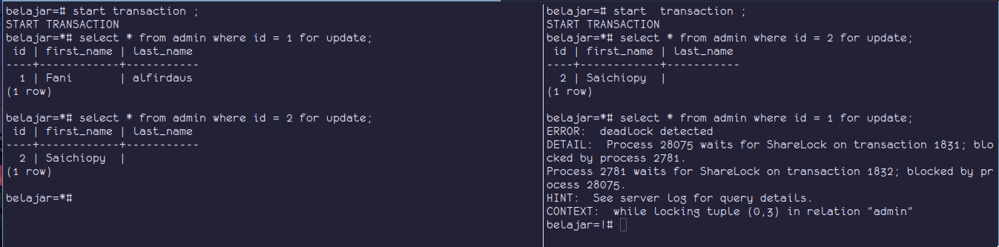

Locking adalah proses penguncian data di DBMS, penguncian data ini sangat penting dilakukan supaya data yang ada di database benar benar terjamin konsistensi nya.

karena pada aplikasi yang di buat, pasti digunakan oleh banyak pengguna, karena bisa saja beberapa pengguna mengakses data yang sama, maka jika tidak ada proses locking pada data tersebut bisa dipastikan akan terjadi `race condition` yaitu proses balapan ketika mengubah data yang sama.

contoh saja ketika belanja di toko online, pengguna akan balapan membeli produk yang sama, jika data tidak terjaga bisa jadi kita salah mengupdate stock dari produk tersebut, karena banyak pengguna yang bersamaan melakukan perubahan pada stock barang tersebut.

saat kita melakukan proses `transaction`, lalu kita melakukan perubahan data maka secara otomatis data yang di ubah tersebut akan di lock dan data akan di lock sampai kita melakukan `commit` atau `rollback` transaction tersebut.

selai melakukan `locking` secara otomatis, proses `locking` juga bisa dilakukan secara manual, misalnya jika kita melakukan select query ke data tertentu sebelum melakukan proses update atau delete, tapi saat kita mau melakukan update ke data tersebut, client lain ternyata telah melakukan update duluan dengan data tersebut.

sebagai contoh kita melakukan select untuk data produk dengan id 1,
saat melakukan select terhadap produk id 1 tersebut, sebelumnya produk tersebut mempunyai harga 1000
setelah itu kita mau update harga produk id tersebut dari 1000 menjadi 2000,

dan ternyata di client lain data produk id 1 tersebut sudah di update duluan harganya yang sebelumnya 1000 di update menjadi 300,
maka yang terjadi di database adalah data tersebut diubah harganya dari 1000 menjadi 3000 lalu di ubah lagi menjadi 2000.

untuk mengatasi kasus tersebut kita bisa langsung mengunci data tersebut pada saat melakukan select query dengan cara menambahkan perintah `for update` di belakang query select nya. Jadi saat melakukan lock data tersebut, jika ada proses lain yang melakukan update data tersebut maka proses tersebut harus menunggu sampai kita selesai melakukan `commit` atau `rollback` untuk transaction tersebut.

saat kita terlalu banyak melakukan proses `locking` hati hati dengan masalah yang terjadi, yaitu **deadlock** , deadlock merupakan situasi 2 proses yang saling menunggu satu sama lain, namun data yang di tunggu tunggu sudah di lock oleh proses lain sehingga proses menunggunya tidak akan pernah selesai.

untuk contoh kasus deadlock bisa dilihat di gambar berikut init

