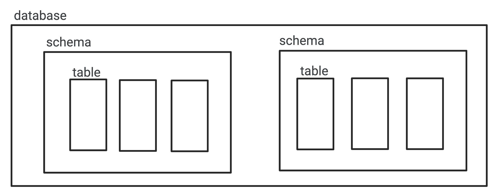

sebelumnya kita bisa ibaratkan sebuah database adalah sebuah folder, dan table adalah sebuah file,
di PostgreSQL ada sebuah fitur bernama `schema`, anggap saja ini adalah sebuah folder didalam database. Secara tidak sadar saat kita membuat table di database sebenarnya table tersebut di simpan didalam schema yang bernama public.

Kita bisa membuat schema lain, dan di schema yang berbeda beda kita bisa membuat sebuah table dengan nama yang sama.

untuk diagram lebih lanjut bisa dilihat di gambar di bawah ini



saat membuat database di PostgreSQL, secara otomatis terdapat sebuah schema bernama public, dan semua table yang dibuat akan di simpan di schema public.

untuk melihat schema yang digunakan saat ini, bisa dengan menggunakan perintah `SELECT current_schema()` atau `SHOW search_path`.
Lalu kita juga bisa membuat atau menghapus schema dengan menggunakan perintah `CREATE SCHEMA nama_schema`, dan untuk menghapus schema yang telah di buat bisa dengan menggunakan perintah `DROP SCHEMA nama_schema`.

Lalu jika ingin menggunakan atau pindah ke schema lain bisa dengan menggunakan perintah `SET search_path TO nama_schema`.
Secara default saat membuat table, maka table tersebut akan di simpan kedalam schema yang sedang digunakan.
Tapi jika kita ingin membuat table di schema yang berbeda tanpa harus berpindah schema dulu maka pada saat pembuatan table, bisa menambahkan `nama_schema.`nama_table pada saat pembuatan table.

Sebagai contoh saat berada di schema public, dan kita ingin membuat table di schema _belajar_ tanpa harus berpindah ke schema belajar terlebih dahulu, maka pada saat pembuatan table bisa dengan cara seperti berikut.

```sql
CREATE TABLE belajar.nama_schema(
    id SMALLSERIAL NOT NULL,
    nama VARCHAR(100) NOT NULL,
    email VARCHAR(100) NOT NULL,
    epoch NUMERIC(13, 3) NOT NULL DEFAULT EXTRACT(EPOCH FROM NOW()),
    PRIMARY KEY(id)
);
```
